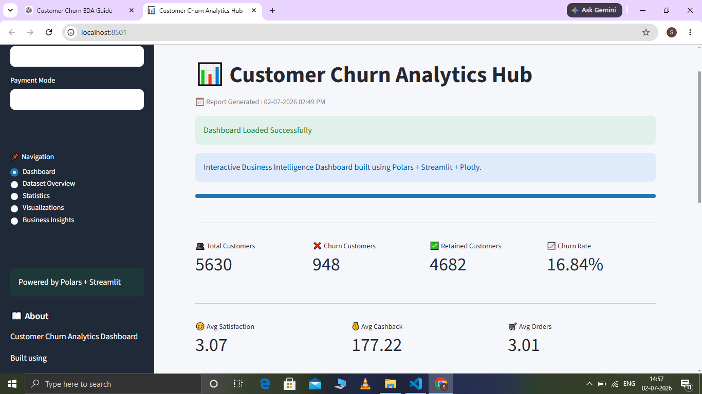

# 📊 Customer Churn Analytics Hub

A Business Intelligence Dashboard built using

- Streamlit
- Polars
- Plotly
- Pandas

---

## Features

- Dashboard KPIs
- Customer Filters
- Churn Analysis
- Dataset Explorer
- Statistical Summary
- Interactive Charts
- Download Dataset
- Search Customer
- Responsive Layout

---

## Technologies

- Python
- Streamlit
- Polars
- Plotly
- Pandas

---

## Project Structure

```
app.py
utils/
assets/
data/
.streamlit/
.github/
```

---

## Dashboard

()

---

## Run

```bash
pip install -r requirements.txt

streamlit run app.py
```

---

## Author

Sasi Rekha